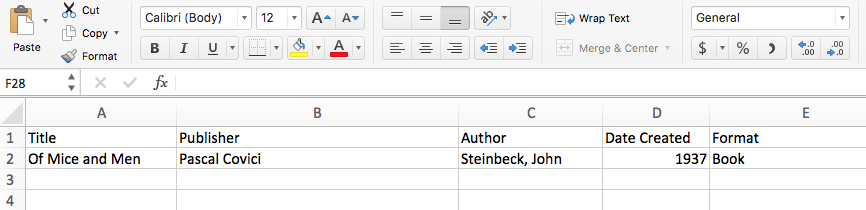
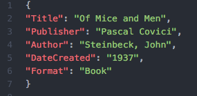

# Introduction to APIs and JSON

[go.ncsu.edu/introapis](http://go.ncsu.edu/introapis)

---

## Outline

- Intro to APIs
- Intro to JSON
- Exercise: Explore an API

---

# Intro to APIs

---

## What is an API?

- Application Programming Interface
- Building blocks for developing a computer program
- Web-based system, operating system, software library, etc
- Specifications for routines, data structures, variables, etc

Note: examples include Windows API for working with Windows OS and Android API for their development kit

---

## Web APIs

>When used in the context of web development, an API is typically a defined set of specifications, such as Hypertext Transfer Protocol (HTTP) request messages, along with a definition of the structure of response messages, which is usually in an Extensible Markup Language (XML) or JavaScript Object Notation (JSON) format.

<span style="font-size:12pt">[Wikipedia](https://en.wikipedia.org/wiki/Application_programming_interface#Web_APIs)</span>

---


<!--  -->

<span style="font-size:12pt">Retrieved from [What's an API and Why Do You Need One?](http://www.govtech.com/applications/Whats-an-API-and-Why-Do-You-Need-One.html)</span>

---

## Examples of Web APIs

- [Twitter APIs](https://developer.twitter.com/en/docs.html)
- [Data.gov APIs](https://api.data.gov/)
- [The Star Wars API (SWAPI)](https://swapi.co/)
- [Google Dataset Search](https://toolbox.google.com/datasetsearch/search?query=format%3Aapi)

---

## API Help(ers)!

- [Twitter API Libraries](https://developer.twitter.com/en/docs/developer-utilities/twitter-libraries.html)
  - [TwitteR](https://www.rdocumentation.org/packages/twitteR/versions/1.1.9)
- [Using Data.gov APIs in R](https://data.library.virginia.edu/using-data-gov-apis-in-r/)
- [SWAPI Helper libraries](https://swapi.co/documentation#python)

---

# Intro to JSON

---

## JSON Basics

- JavaScript Object Notation is a data format
- Based on a subset of the JavaScript Programming Language
- Text based and language independent


---

## Simple JSON Example




---

## JSON Data Types

- Strings: <span style="color:red">`"name"`</span>`:` <span style="color:green">`"Jacob"`</span>
- Numbers: <span style="color:red">`"age"`</span>`:` <span style="color:orange">`30`</span>
- Objects: <span style="color:red">`"employee"`</span>`:` `{` <span style="color:red">`"name"`</span>`:`<span style="color:green">`"Jacob"`</span>`,`<span style="color:red">` "age"`</span>`:`<span style="color:orange">`30`</span>`}`
- Arrays: <span style="color:red">`"employees"`</span>`: [`<span style="color:green">`"Jacob", "Walt"`</span>`]`
- Booleans: <span style="color:red">`"librarian"`</span>`:` <span style="color:blue">`true`</span>

[More on JSON Data Types](https://www.w3schools.com/js/js_json_datatypes.asp)

---

## Complex JSON Example

```json
{
  "paintings": [
    {
      "name": "The Scream",
      "url": "https://en.wikipedia.org/wiki/The_Scream",
      "creator": {
        "@type": "Person",
        "name": "Edvard Munch",
        "sameAs": "https://en.wikipedia.org/wiki/Edvard_Munch"
      }
    },
    {
      "name": "Melancholy",
      "url": "https://en.wikipedia.org/wiki/Melancholy_(Edvard_Munch)",
      "creator": {
        "@type": "Person",
        "name": "Edvard Munch",
        "sameAs": "https://en.wikipedia.org/wiki/Edvard_Munch"
      }
    }
  ]
}
```

---

## JSON Help!

- [JSONLint](https://jsonlint.com/)
- [[Microsoft Excel] Connect to a JSON File](https://support.office.com/en-us/article/connect-to-a-json-file-f65207ab-d957-4bf0-bec3-a08bb53cd4c0)
- [Your JSON data is ready for analysis in Tableau 10.1!](https://www.tableau.com/about/blog/2016/9/your-json-data-ready-analysis-tableau-101-59543)

---

# Scavenger Hunt! Explore SWAPI

---

## What is SWAPI?

[swapi.co](https://swapi.co)

- Star Wars API
- Structured data about episodic Star Wars films, up through The Force Awakens
- Info about films, people, planets, species, starships, vehicles (entities)
---

## Navigating SWAPI

[swapi.co](https://swapi.co)

- Data organized into buckets
- https://swapi.co/api/people returns data about all people
- https://swapi.co/api/people/1 returns data about the first person in the index, Luke Skywalker
- Each entity is connected to other entities by nesting URLs

```JSON
{
  "name": "Luke Skywalker",
  "films": [
    "https://swapi.co/api/films/2/"
  ],
  "species": [
    "https://swapi.co/api/species/1/"
  ]
}
```

---

## Instructions

Using your browser, explore SWAPI and answer these questions:

1. Which movies did George Lucas produce?
2. When was The Force Awakens released?
3. According to the API, which planets were featured in The Empire Strikes Back?
  - Which of these planets has the highest pop?

[swapi.co](https://swapi.co)

---

## Questions?

**Thank you!**

Jacob Shelby - jtshelby@ncsu.edu

Mike Nutt - mrnutt@ncsu.edu
